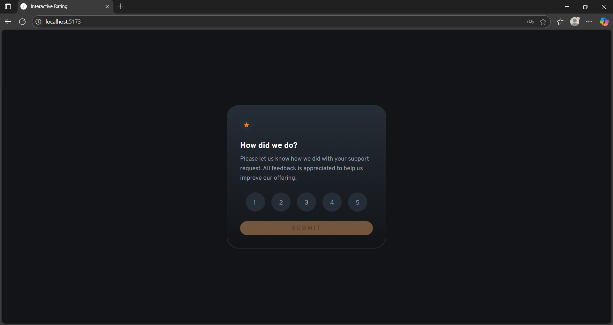
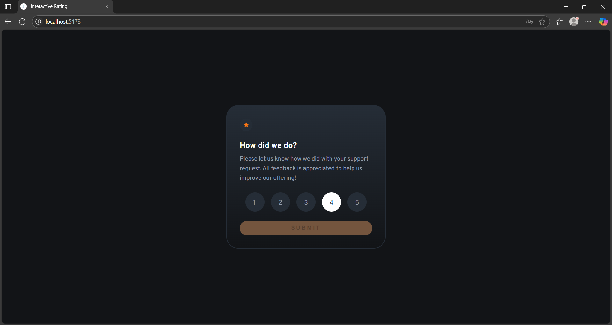
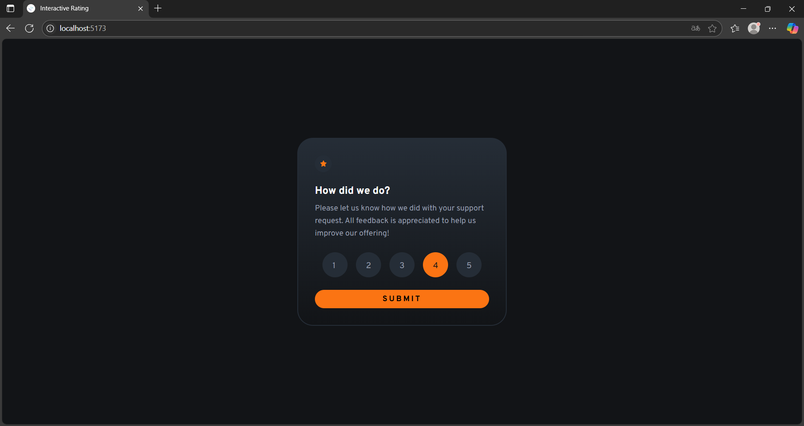
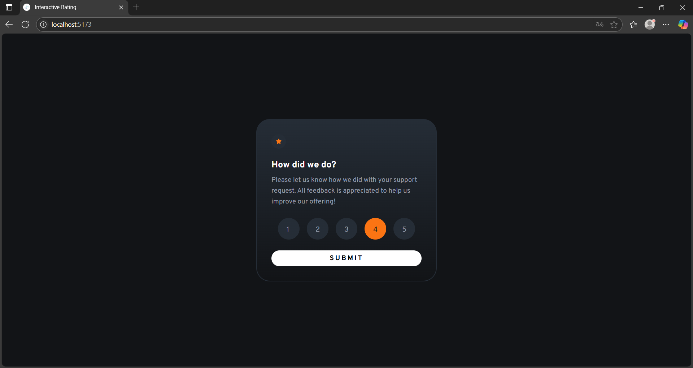
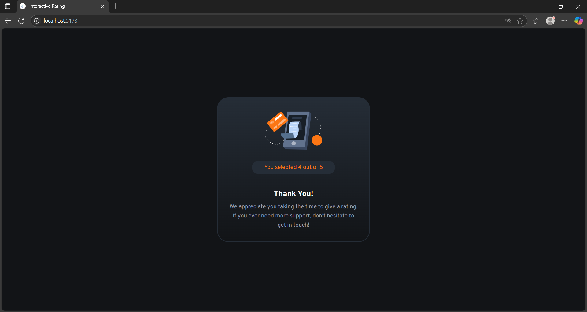

## Frontend Mentor – Interactive Rating Component Solution

[](https://interactive-rating-component-1.vercel.app)
[](#license)

A production-ready, refined implementation of the **Interactive Rating Component** challenge from Frontend Mentor. This repository showcases a scalable React architecture, meticulous styling, and thoughtful UX.

---

## 📖 Table of Contents

1. [Overview](#overview)
2. [Demo](#demo)
3. [Features](#features)
4. [Tech Stack](#tech-stack)
5. [Project Structure](#project-structure)
6. [Getting Started](#getting-started)
7. [Key Learnings](#key-learnings)
8. [Author](#author)

---

## 🎯 Overview

* **Objective:** Allow users to select a rating (1–5) and submit their feedback, then display a thank-you state with the chosen rating.
* **Requirements:** Responsive layout, intuitive hover/focus states, single-selection logic, accessible markup, and seamless transition between input and acknowledgment screens.

---

## 🚀 Demo







Experience it live: [interactive-rating-component-1.vercel.app](https://interactive-rating-component-1.vercel.app)

---

## ✨ Features

* **Responsive Layout:** Fluid grid and flexbox ensure an optimal presentation on mobile, tablet, and desktop.
* **Interactive States:** Custom hover and focus styles for buttons and rating elements.
* **Single-Select Logic:** Only one rating can be active at a time; clicking the selected rating toggles it off.
* **Accessible Markup:** Semantic HTML5 elements with ARIA attributes where appropriate.
* **State Management:** Lightweight custom hook (`useRating`) encapsulates selection logic.
* **Smooth Transitions:** React-controlled conditional rendering for seamless state changes.

---

## 🛠️ Tech Stack

* **Language & Framework:** JavaScript (ES6+), React 18
* **Build Tool:** Vite
* **Styling:** Styled Components, CSS Custom Properties, Flexbox, CSS Grid
* **Version Control:** Git & GitHub
* **Deployment:** Vercel

---

## 📂 Project Structure

```
/src
├── assets/                  # Static images and SVGs
├── components/              # Reusable UI components
│   ├── Button/              # Generic button component
│   ├── FeedbackCard/        # Rating input card
│   ├── Rater/               # Numeric rating button
│   └── ThankYouCard/        # Acknowledgment card
├── container/
│   └── CardSwitcher/        # Card-switching logic
├── hooks/
│   └── useRating/           # Selection logic hook
├── styles/                  # Global styles and theme (globals.css)
├── App.jsx                  # Root component (CardSwitcher)
└── main.jsx                 # Application entry point
```

---

## 🏁 Getting Started

### Prerequisites

* Node.js (v16 or later)
* npm or Yarn

### Installation

1. **Clone the repository**

   ```bash
   git clone https://github.com/fabiomoretao/interactive-rating-component.git
   cd interactive-rating-component
   ```

2. **Install dependencies**

   ```bash
   npm install
   # or
   yarn install
   ```

3. **Run in development mode**

   ```bash
   npm run dev
   # or
   yarn dev
   ```

4. **Build for production**

   ```bash
   npm run build
   # or
   yarn build
   ```

5. **Preview production build**

   ```bash
   npm run preview
   # or
   yarn preview
   ```

---

## 📚 Key Learnings

* Designed a clear separation of concerns between UI presentation and state logic using a custom React Hook (`useRating`).

  ```jsx
  // useRating.js
  import { useState, useCallback } from 'react';

  export default function useRating() {
    const [selected, setSelected] = useState(null);
    const handleSelect = useCallback((value) => {
      setSelected((prev) => (prev === value ? null : value));
    }, []);

    return { selected, handleSelect };
  }
  ```

* Leveraged styled-components to maintain scoped, themeable styles without class name collisions.

* Ensured accessibility with semantic elements and ARIA roles for interactive controls.

* Utilized Vite for rapid HMR and optimized build output.

---

## 👤 Author

**Fábio Moretão**
Frontend Engineer & Enthusiast

* Frontend Mentor: [@fabiomoretao](https://www.frontendmentor.io/profile/fabiomoretao)
* Instagram: [@fabio\_moretao](https://www.instagram.com/fabio_moretao)
