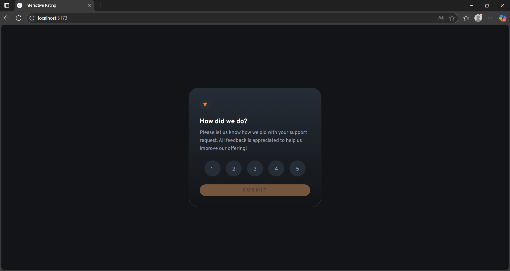

# Frontend Mentor - Interactive rating component solution

This is a solution to the [Interactive rating component challenge on Frontend Mentor](https://www.frontendmentor.io/challenges/interactive-rating-component-koxpeBUmI). Frontend Mentor challenges help you improve your coding skills by building realistic projects. 

## Table of contents

- [Overview](#overview)
  - [The challenge](#the-challenge)
  - [Screenshot](#screenshot)
  - [Links](#links)
- [My process](#my-process)
  - [Built with](#built-with)
  - [What I learned](#what-i-learned)
  - [Continued development](#continued-development)
- [Author](#author)

## Overview

### The challenge

Users should be able to:

- View the optimal layout for the app depending on their device's screen size
- See hover states for all interactive elements on the page
- Select and submit a number rating
- See the "Thank you" card state after submitting a rating

### Screenshot




### Links

- Solution URL: [Add solution URL here](https://your-solution-url.com)
- Live Site URL: [Add live site URL here](https://your-live-site-url.com)

## My process

### Built with

- Semantic HTML5 markup
- CSS custom properties
- Flexbox
- CSS Grid
- [React](https://reactjs.org/) - JS library
- [Vite](https://pt.vite.dev) - Build tool
- [Styled Components](https://styled-components.com/) - For styles

### What I learned
I enhanced my web development skills with React and refined my command of CSS. I also adopted new architectures and organized project folder structures more efficiently.

Function to switch between cards
```js
function CardSwitcher() {
    const { selectedRating, handleSelect } = useRating()

    const [submited, setSubmited] = useState(false)
    function handleSubmit() {
        setSubmited(true)}

    return (
        <div>
            {
            submited ? 
            <ThankYouCard selectedRating = { selectedRating }/> : 
            <FeedbackCard selectedRating = { selectedRating } handleSelect = { handleSelect } send={handleSubmit} 
            />}
        </div>
    )
}
```

Function to choose only one of the feedback options
```js
import { useState, useCallback } from "react"

export default function UseRating(){
       const [selectedRating, setSelectedRating] = useState(null)
    
       const handleSelect = useCallback ((number) =>{
        setSelectedRating(prev => prev === number ? null : number)
       }, []);

       return { selectedRating, handleSelect }    
}   
```

### Continued development

I have enhanced my React and CSS skills, and I plan to learn Next.js in the future.

## Author

- Fábio Moretão
- Frontend Mentor - [@fabiomoretao](https://www.frontendmentor.io/profile/fabiomoretao)
- Instagram - [fabio_moretao](https://www.instagram.com/fabio_moretao)

